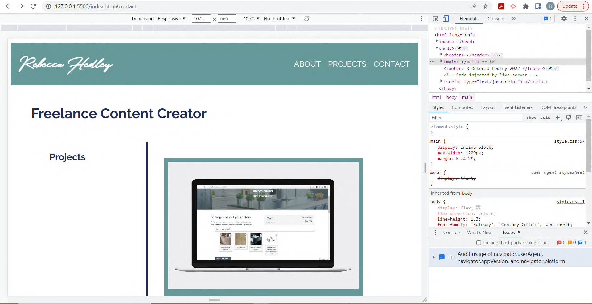

# Week Two Challenge: Portfolio

## Description

This repository is where I build a portfolio to showcase my work for potential employers.

## Installation

N/A

## Usage

Links to my past work can be found by opening the web page and navigating via the links. Info on mobile responsiveness can be found by opening the web page in a Chrome browser and using the Inspect option to access the Chrome Developer Tools.

Website URL: (https://bechedley.github.io/portfolio/)

    md
    
    

## Credits

The following resources were referenced to ensure best practice and adherence to appropriate conventions:

Reference guidelines: A Guide to Flexbox by CSS Tricks (https://css-tricks.com/snippets/css/a-guide-to-flexbox/)

Online px to em font converter: CSS PX to EM Conversion by W3 Schools (https://www.w3schools.com/cssref/css_pxtoemconversion.asp)

Form actions to send data: How to Get Email from an HTML Form by html.form.guide (https://html.form.guide/email-form/html-email-form/#:~:text=There%20is%20no%20feature%20in,to%20the%20email%20address%20specified.)

Alternative fonts: Identifont - Raleway (http://www.identifont.com/list?3+Raleway+0.30+31MF+1+1ZA+2+58HY+2+6F6+2+O3+2+N47+4+MKO+4+2DM1+4+BF+4+5GRB+4+45OH+4+8NJ+4+2OS+4+4DSW+4+23AU+4+2JUS+4+4DET+4+272+4+7MZ+4+2CV+4+3N62+4+43RG+4+IB5+4+5ZR+4+688+4+2X8N+5+1N2+5+2RBB+5+9Y0+5+2DPC+5)

Alternative fonts: Most Useable Cursive Fonts by designmodo (https://designmodo.com/cursive-webfonts/)

Alternative fonts: Handwriting by Google Fonts (https://fonts.google.com/?category=Handwriting)

## License

Licensed under the standard MIT license. Please refer to the license in the repo for more information.